# 2301379 THEORY OF COMPUTATION

## Table of Contents
- [Midterm](#midterm)
  - [Finite Automata](#finite-automata)
    - [Formal definition](#formal-definition)
    - [Computation](#computation)
  - [Regular Languages](#regular-languages)
  - [Regular Expressions](#regular-expressions)
  - [Closure Properties for Regular Languages](#closure-properties-for-regular-languages)
  - [Nondeterministic Finite Automata](#nondeterministic-finite-automata)
    - [Formal definition](#formal-definition-1)
  - [Converting NFAs to DFAs](#converting-nfas-to-dfas)
  - [Return to Closure Properties](#return-to-closure-properties)
  - [Converting Regular Expressions to NFA](#converting-regular-expressions-to-nfa)
  - [Converting DFAs to Regular Expressions](#converting-dfas-to-regular-expressions)
  - [Generalized NFA](#generalized-nfa)
  - [Converting GNFA to Regular Expressions](#converting-gnfa-to-regular-expressions)
    - [Converting k state GNFA to k-1 state GNFA](#converting-k-state-gnfa-to-k-1-state-gnfa)
  - [Non-Regular Languages](#non-regular-languages)
  - [Method for Proving Non-regularity (Pumping Lemma)](#method-for-proving-non-regularity-pumping-lemma) 
  - [Context Free Grammars](#context-free-grammars)
    - [Formal definition](#formal-definition-2)
  - [Pushdown Automata](#pushdown-automata)
    - [Formal definition](#formal-definition-3)
  - [Converting CFGs to PDAs](#converting-cfgs-to-pdas)
  - [Equivalence of CFGs and PDAs](#equivalence-of-cfgs-and-pdas)
  - [Proving Languages not Context Free](#proving-languages-not-context-free)
- [Midterm Quick Reference](#midterm-quick-reference)
  - [Closure Properties](#closure-properties)

# Midterm

## Finite Automata

**Input**: finite string

**Output**: *Accept* or *Reject*

**Computation process**: Begin at **start state**, read input symbols, follow corresponding transitions, **accept** if end with accept state, **reject** if not.

$M_{1}$ accepts exactly those strings in $A$ where $` A = \{w \mid w \text{ contains substring } 11\} `$

We say that $A$ is the language of $M_{1}$ and that $M_{1}$ recognizes $A$ and that $A = L(M_{1})$.

### Formal definition

**Definition**: A finite automaton $M$ is a 5-tuple $(Q, \Sigma, \delta, q_{0}, F)$

$Q$ - finite set of states

$\Sigma$ - finite set of alphabet symbols

$\delta$ - transition function $\delta: Q \times \Sigma \rightarrow Q$ 

$q_{0}$ - start state

$F$ - set of accept states

We can describe $M_{1}$ above with the following notation:

$M_{1} = (Q, \Sigma, \delta, q_{1}, F)$

$` Q = \{q_{1}, q_{2}, q_{3}\} `$

$` \Sigma = \{0, 1\} `$

$` F = \{q_{3}\} `$

$\delta =$ 

|         | 0       | 1       |
| :-----: | :-----: | :-----: |
| $q_{1}$ | $q_{1}$ | $q_{2}$ |
| $q_{2}$ | $q_{1}$ | $q_{3}$ |
| $q_{3}$ | $q_{3}$ | $q_{3}$ |

### Computation

**Strings and languages**

- A *string* is a finite sequence of symbols in $\Sigma$
- A *language* is a set of strings (finite or infinite)
- The *empty string* $\varepsilon$ is the string of length 0
- The *empty language* $\varnothing$ is the set with no strings

**Definition**: $M$ accepts string $w = w_{1} w_{2} \ldots w_{n}$ each $w_{i} \in \Sigma$ if there is a sequence of states $r_{0}, r_{1}, r_{2}, \ldots, r_{n} \in Q$
where:
- $r_{0} = q_{0}$
- $r_{i} = \delta(r_{i-1}, w_{i})$ for $1 \leq i \leq n$
- $r_{n} \in F$

**Recognizing languages**

- $` L(M) = \{w \mid M \text{ accepts } w\} `$
- $L(M)$ is the language of $M$
- $M$ recognizes $L(M)$

**Definition**: A language is *regular* if some finite automaton recognizes it.

## Regular Languages

$` L(M_{1}) = \{w \mid w \text{ contains substring } 11\} = A `$

$\therefore A$ is regular

Examples:

Let $` B = \{w \mid w \text{ has an even number of 1s}\} `$

$B$ is regular

Let $` C = \{w \mid w \text{ has equal numbers of 0s and 1s}\} `$

$C$ is not regular

There is no way to recognize $C$ with a finite automaton.

## Regular Expressions

**Regular operations**

Let $A$ and $B$ be languages:

- Union: $` A \cup B = \{w \mid w \in A \text{ or } w \in B\} `$
- Concatenation: $` A \cdot B = \{xy \mid x \in A \text{ and } y \in B\} `$
- Star: $` A^{*} = \{x_{1}\ldots x_{k} \mid \text{each } x_{i} \in A \text{ for } k \geq 0\} `$ Note: $` \varepsilon \in A^{*} `$

Example:

Let $A$ = {good, bad} and $B$ = {boy, girl}
- $A \cup B$ = {good, bad, boy, girl}
- $AB$ = {goodboy, goodgirl, badboy, badgirl}
- $` A^{*} `$ = {$` \varepsilon `$, good, bad, goodgood, goodbad, badgood, badbad, goodgoodgood, goodgoodbad, ... }

**Regular expressions**

- Built from $\Sigma$, members $\Sigma$, $\varnothing$, $\varepsilon$ (Atomic)
- By using $\cup$, $\cdot$, $*$ (Composite)

Examples:

- $` (0 \cup 1)^{*} = \Sigma^{*} `$ gives all strings over $\Sigma$
- $` \Sigma^{*}1 `$ gives all strings that end with 1
- $` \Sigma^{*}11\Sigma^{*} `$ gives all strings that contain 11

## Closure Properties for Regular Languages

**Theorem**: If $A_{1}$ and $A_{2}$ are regular languages, so is $A_{1} \cup A_{2}$ *(closure under union)*

*When a collection of objects is said to be closed under an operation, it means that applying that operation to the objects results in objects that still belong to the same class of objects.*

**Proof**:

Let $M_{1} = (Q_{1}, \Sigma_{1}, \delta, q_{1}, F_{1})$ recognize $A_{1}$

Let $M_{2} = (Q_{2}, \Sigma_{2}, \delta, q_{2}, F_{2})$ recognize $A_{2}$

Construct $M = (Q, \Sigma, \delta, q_{0}, F)$ recognizing $A_{1} \cup A_{2}$

$M$ should accept input $w$ if either $M_{1}$ or $M_{2}$ accept $w$.

**Strategy**: Take $M_{1}$ and $M_{2}$ then run both of them in parallel on the input $w$. At the end, if either of the two machines is in an accepting state, then $M$ accepts $w$.

**Components of $M$**:

$Q = Q_{1} \times Q_{2} = \{(q_{1}, q_{2}) \mid q_{1} \in Q_{1} \text{ and } q_{2} \in Q_{2}\}$

$q_{0} = (q_{1}, q_{2})$

$\delta((q, r), a) = (\delta_{1}(q, a), \delta_{2}(r, a))$

$F = (F_{1} \times Q_{2}) \cup (Q_{1} \times F_{2})$

**Theorem**: If $A_{1}$ and $A_{2}$ are regular languages, so is $A_{1}A_{2}$ *(closure under concatenation)*

Let $M_{1} = (Q_{1}, \Sigma_{1}, \delta, q_{1}, F_{1})$ recognize $A_{1}$

Let $M_{2} = (Q_{2}, \Sigma_{2}, \delta, q_{2}, F_{2})$ recognize $A_{2}$

Construct $M = (Q, \Sigma, \delta, q_{0}, F)$ recognizing $A_{1}A_{2}$

$M$ should accept input $w$ if $w = xy$ where $M_{1}$ accepts $x$ and $M_{2}$ accepts $y$.

**Strategy**: $M$ has to split the input $w$ in a way that it gets accepted by both machines without being able to see the future. -> Use ***nondeterminism***.

##  Nondeterministic Finite Automata

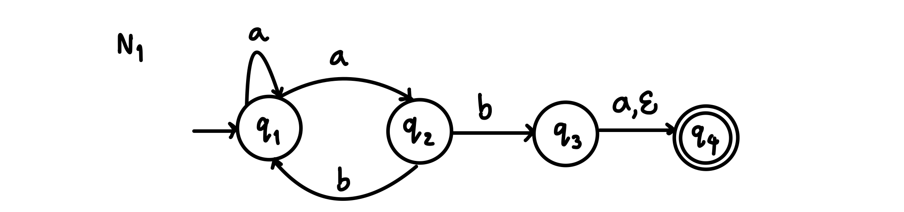

NFAs can have multiple possible transitions for each input symbol (including none at all), unlike DFAs which require a single unique transition for each input symbol.

- multiple paths possible (0, 1 or many)
- $\varepsilon$-transition is a "free" move without reading input.
- Accept input if *some* path leads to an accepting state. (acceptance overrules rejection)

**Computation process**: Begin at start state and read input symbols. Now, there might be two different paths to follow. Keep track of both of them. The machine can be thought of as being in two states simultaneously. Next, read the next symbol and take each of the places where the machine could be at the end of the previous symbol, then follow the paths from those states. If it has nowhere to go, that branch ends. If it has a way to go, and the next state has an empty string $(\varepsilon)$ symbol on its transition arrow, the machine can either stay or move along that arrow without reading an input.

Example inputs:
- ab -> ***Accept***
- aa -> ***Reject***
- aba -> ***Accept***
- abb -> ***Reject***

Nondeterminism does not correspond to a physical machine we can build. However, it is useful mathematically.

### Formal definition

**Definition**: A nondeterministic finite automaton (NFA) $N$ is a 5-tuple $(Q, \Sigma, \delta, q_{0}, F)$

$Q$ - finite set of states

$\Sigma$ - finite set of alphabet symbols

$\delta$ - transition function $` \delta: Q \times \Sigma_{\varepsilon} \rightarrow \mathcal{P}(Q) = \{R \mid R \subseteq Q \} `$

Note: $` \Sigma_{\varepsilon} = \Sigma \cup {\varepsilon} `$ , $\mathcal{P}$ = power set

$q_{0}$ - start state

$F$ - set of accept states

We can describe the transition function of $N_{1}$ above as follows:

$` \delta(q_{1},a) = \{q_{1}, q_{2} \} `$

$` \delta(q_{1},b) = \varnothing `$

Ways to think about nondeterminism:

*Computational*: Fork new parallel thread and accept if any thread leads to an accepting state.

*Mathematical*: Tree with branches. Accept if any branch leads to an accepting state.

*Magical*: Guess at each nondeterministic step which way to go. Machine always makes the right guess that leads to an accepting state, if possible.

## Converting NFAs to DFAs

**Theorem**: an NFA recognizes $A$, then $A$ is regular.

**Proof**:

Let NFA $M = (Q, \Sigma, \delta, q_{0}, F)$ recognize $A$

Construct DFA $M' = (Q', \Sigma, \delta', q'_{0}, F')$ recognizing $A$ (ignore $\varepsilon$-moves)

**IDEA**: DFA $M'$ keeps track of the subset of possible states in NFA $M$.

Construction of $M'$:

$Q' = \mathcal{P}(Q)$

$` \delta'(R,a) = \{q \mid q \in \delta(r,a) \text{ for some } r \in R \} `$

$` q'_{0} = \{q_{0}\} `$

$` F' = \{R \in Q' | R \text{ intersects } F\} `$

$Q'$ is the set of subset of states of the original machine $M$.

The accepting state $F'$ are all of the subsets that have at least one accepting state from the NFA.

If $M$ has $n$ states, $M'$ has $2^{n}$ states by this construction.

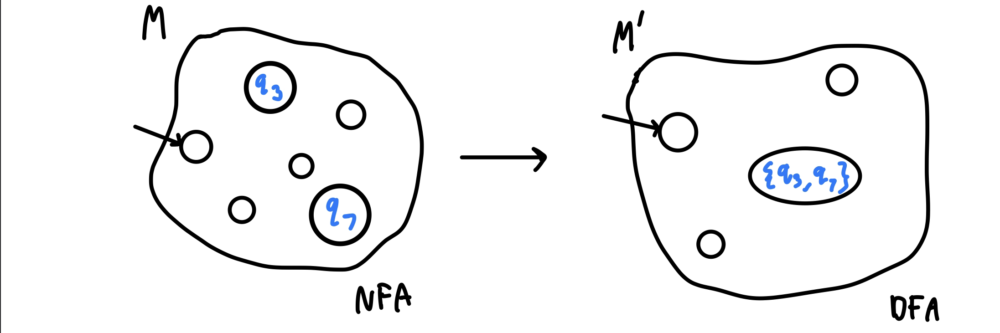

## Return to Closure Properties

**Recall Theorem**: If $A_{1}$ and $A_{2}$ are regular languages, so is $A_{1} \cup A_{2}$ *(closure under union)*

**New Proof (sketch)**:

Given DFAs $M_{1}$ and $M_{2}$ recognizing $A_{1}$ and $A_{2}$

Construct NFA M recognizing $A_{1} \cup A_{2}$

**Strategy**: Use $\varepsilon$-moves to run both $M_{1}$ and $M_{2}$ in parallel.

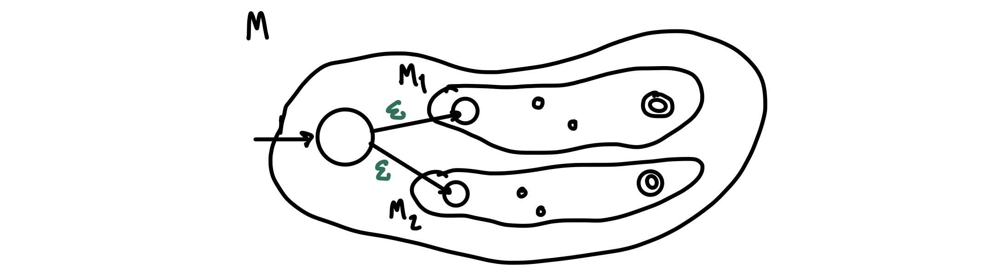

**Theorem**: If $A_{1}$ and $A_{2}$ are regular languages, so is $A_{1}A_{2}$ *(closure under concatenation)*

**Proof sketch**:

Given DFAs $M_{1}$ and $M_{2}$ recognizing $A_{1}$ and $A_{2}$

Construct NFA M recognizing $A_{1}A_{2}$

$M$ should accept input $w$ if $w = xy$ where $M_{1}$ accepts $x$ and $M_{2}$ accepts $y$.

Nondeterministic $M'$ has the option to jump to $M_{2}$ when $M_{1}$ accepts. It can both stay in $M_{1}$ to continue reading more of the input and start processing what might be the second half of the input which $M_{2}$ accepts.

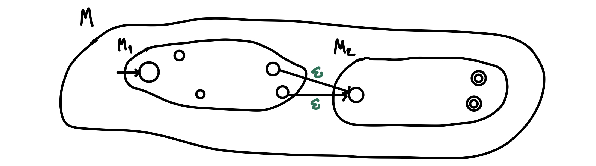

**Theorem**: If $A$ is a regular language, so is $` A^{*} `$ *(closure under star)*

**Proof sketch**:

Given DFA $M$ recognizing $A$

Construct NFA $M'$ recognizing $` A^{*} `$

$M$ should accept input $w$ if $w = x_{1}x_{2} \ldots x_{k}$ where $k \geq 0$ and $M$ accepts each $x_{i}$

**Strategy**: Start machine again when $M$ accepts by using $\varepsilon$-moves to allow an option to move back to the start state or continue processing. Make sure $M'$ accepts $\varepsilon$ by making a start state that is also an accepting state that will never be returned to before branching to the start state of $M$.

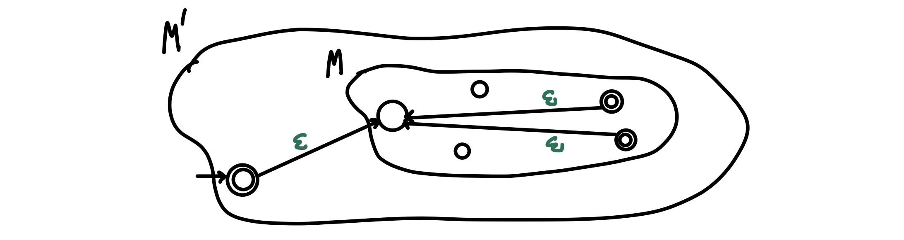

## Converting Regular Expressions to NFA

**Theorem**: If $R$ is a regular expression, and $A = L(R)$, then $A$ is regular.

**Proof**:

Convert $R$ to equivalent of NFA $M$:

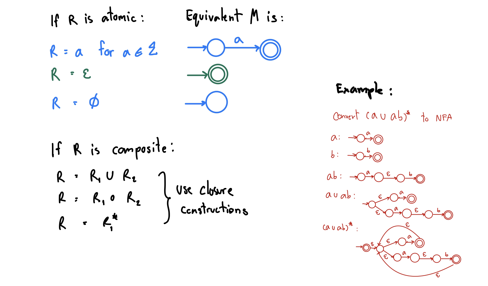

## Converting DFAs to Regular Expressions

**Theorem**: If $A$ is regular, then $A = L(R)$ for some regular expression $R$

**Proof**:

Give conversion DFA $M \rightarrow R$

Use GNFA below.

## Generalized NFA

**Definition**: A Generalized Nondeterministic Finite Automaton (GNFA) is similar to an NFA, but allows regular expressions as transition labels.

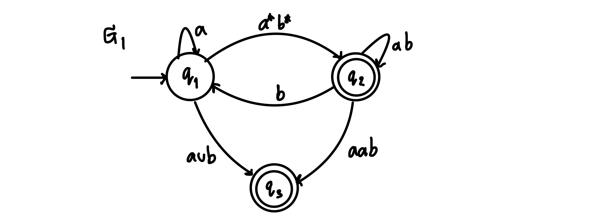

## Converting GNFA to Regular Expressions

**Lemma**: Every GNFA $G$ has an equivalent regular expression $R$

**Proof**: By induction on the number of states $k$ of $G$

*Basis* (k = 2):

Let $R = r$

*Induction step* (k > 2): Assume Lemma true for $k-1$ states and prove for $k$ states

**IDEA**: Convert $k$-state GNFA to equivalent $(k-1)$-state GNFA

### Converting k state GNFA to k-1 state GNFA

1. Pick any state $x$ except the start and accept states.
2. Remove $x$
3. Repair the damage by recovering all paths that went through $x$
4. Make the indicated change for each pair of states $q_{i},q_{j}$ 

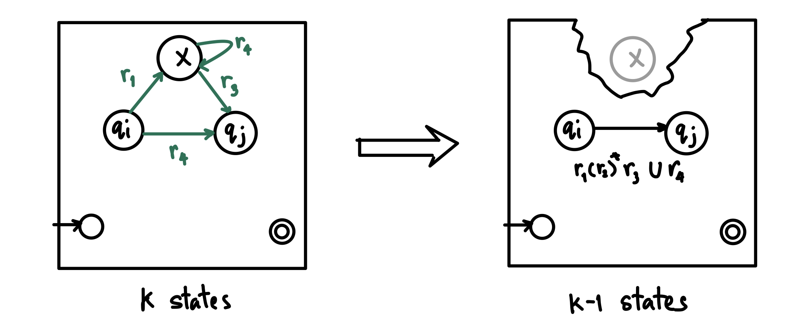

DFAs are a type of GNFAs thus DFAs and regular expressions are equivalent.

## Non-Regular Languages

**How to show a language is not regular?**

- *To show a language is regular, we give a DFA.*
- To show a language is ***not*** regular, we must give a proof.
- It is not enough to say that you couldn't find a DFA for it, therefore the language isn't regular.

Examples: Assume $` \Sigma = \{0,1\} `$

Let $` B = \{w \mid w \text{ has equal numbers of 0s and 1s } \} `$

*Intuition*: $B$ is not regular because DFAs cannot count unboundedly.

Let $` C = \{ w \mid w \text{ has equal numbers of 01 and 10 substrings } \} `$

$0101 \notin C$

$0110 \in C$

*Intuition*: $C$ is not regular because DFAs cannot count unboundedly.

**However $C$ is regular!**

**Sometimes intuition can be wrong, you need to give a proof.**

## Method for Proving Non-regularity (Pumping Lemma)

**Pumping Lemma**: For every regular language $A$, there is a number $p$ (the "pumping length") such that if $s \in A \text{ and } \left | s \right | \geq p \text { then } s = xyz$ where

1. $xy^{i}z \in A$ for all $i \geq 0$; $y^{i} = yy \ldots y_{i}$
2. $y \neq \varepsilon$
3. $\left | xy \right | \leq p$

Informally: $A$ is regular -> every long string in $A$ can be pumped and the result stays in $A$.

**Proof**:

Let DFA $M$ recognize $A$.

Let $p$ be the number of states in $M$. Pick $s \in A$ where $\left | s \right | \geq p$

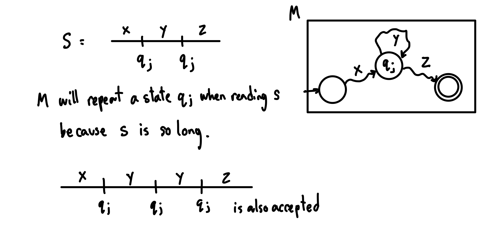

The Pumping Lemma depends on the fact that if $M$ has $p$ states and it runs for more than $p$ steps then $M$ will enter some state at least twice.

This is known as the ***Pigeonhole Principle***.

**Example 1**

Let $` D = \{0^{k}1^{k} \mid k \geq 0\} `$

**Show**: $D$ is not regular

**Proof by contradiction**:

Assume that $D$ is regular.

The pumping lemma gives $p$ as above.

Let $s = 0^{p}1^{p} \in D$

$s = 000 \ldots 0001111 \ldots 111$ (a bunch of 0s followed by an equal number of 1s)

The string is in $D$ because $D$ is strings of that form.

The string is longer than $p$ because it is of length $2p$.

Pumping Lemma says that we can divide $s = xyz$ satisfying the 3 conditions.

The first two pieces we cut lie in the first $p$ symbols of $s$ at most $p$ long. So $x$ and $y$ together do not extend beyond the first half of $s$ (since $s$ is of length $2p$). As such, $x$ and $y$ are going to be all zeroes. $z$ might have some zeroes, and will have the rest of the ones.

Pumping Lemma says that if we cut it up this way, we can repeat $y$ as many times as we like while still staying in the language.

But $xyyz$ has too many zeroes since $y$ is all zeroes. The resulting string is no longer of the form $0^{k}1^{k}$ as there are more zeroes than ones.

$xyyz \notin D$ contradicts the pumping lemma.

Therefore our assumption that $D$ is regular is false.

We conclude that $D$ is not regular.

**Example 2**

Let $` F = \{ww \mid w \in \Sigma^{*} \} `$

Say $` \Sigma^{*} = \{ 0,1 \}`$

**Show**: $F$ is not regular

**Proof by contradiction**:

Assume that $F$ is regular.

The pumping lemma gives $p$ as above. Need to choose $s \in F$.

Try $s = 0^{p}0^{p} \in F$

$s = 000 \ldots 000000 \dots 000$

Let $y = 00$

$s$ can be pumped. Let's try another $s$ since we haven't learned anything new.

Try $s = 0^{p}10^{p}1 \in F$

$s = 000 \ldots 001000 \ldots 001$

The first two pieces are all zeroes. So when you repeat $y$, you will no longer have two copies of the same string.

$xyyz \notin F$

There is a contradiction. Therefore $F$ is not regular.

**Example 3**

**Variant**: Combine closure properties with the Pumping Lemma.

Let $` B = \{ w \mid w \text{ has equal numbers of 0s and 1s } \} `$

**Show**: $B$ is not regular.

**Proof by contradiction**:

Assume that $B$ is regular.

We know that $` 0^{*}1^{*} `$ is regular so $` B \cap 0^{*}1^{*} `$ is regular (closure under intersection).

But $` D = B \cap 0^{*}1^{*} `$ and we already showed that $D$ is not regular, so there is a contradiction. *(Example 1)*

Therefore, our assumption is false, and $B$ is not regular.

## Context Free Grammars

$G_{1}$

$S \rightarrow  0S1$

$S \rightarrow R$

$R \rightarrow \varepsilon$

(written in one line: $S \rightarrow  0S1 \mid R$)

**Rule**: Variable -> string of variables and terminals

**Variables**: Symbols appearing on left-hand side of rule

**Terminals**: Symbols appearing only on right-hand side, excluding $\varepsilon$

**Start Variable**: Top left symbol

**Grammars generate strings**

1. Write down start variable
2. Replace any variable according to a rule. (When you see an $S$ replace it with $0S1$ or $R$). Repeat until only terminals remain.
3. Result is the generated string
4. $L(G)$ is the language of all generated strings.

Example of $G_{1}$ generating a string

| Substitution Tree | Resulting string |
| :---------------: | :--------------: |
| **S**             | S                |
| 0 **S** 1         | 0S1              |
| 0 0 **S** 1 1     | 00S11            |
| 0 0 **R** 1 1     | 00R11            |
| 0 0 ε 1 1         | 0011             |

$0011 \in L(G_{1})$

$` L(G_{1}) = \{0^{k}1^{k} \mid k \geq 0\}`$

### Formal definition

**Definition**: A context free grammar (CFG) $G$ is a 4-tuple $(V, \Sigma, R, S)$

$V$ = finite set of variables

$\Sigma$ = finite set of terminal symbols

$R$ = finite set of rules $` (V \rightarrow (V \cup \Sigma)^{*}) `$

$S$ = start variable

For $` u,v \in (V \cup \Sigma)^{*} `$ write

1) $u \rightarrow v$ (u yields v) if can go from $u$ to $v$ with one substitution step in $G$
2) $` u \overset{*}{\rightarrow} v `$ (u derives v) if can go from $u$ to $v$ with some number of substitution steps in $G$

$` L(G) = \{w \mid w \in \Sigma^{*} \text{ and } S \overset{*}{\rightarrow} w\} `$

**Definition**: $A$ is a context free language (CFL) if $A = L(G)$ for some CFG $G$.

Example:

$G_{2}$

$E \rightarrow E+T \mid T$

$T \rightarrow T \times F \mid F$

$F \rightarrow (E) \mid a$

$`V = \{E, T, F\} `$

$`\Sigma = \{+, \times, (,), a\} `$

$R$ = the 6 rules aboce

$S = E$

| Parse Tree        | Resulting string |
| :---------------: | :--------------: |
| **E**             | E                |
| *E* + **T**       | E+T              |
| *T* **T x F**     | T+TxF            |
| *F* **F** **a**   | F+Fxa            |
| *a* **a** **a**   | a+axa            |

Generates $a + a \times a$, $(a+a) \times a$, $a$, $a+a+a$, etc.

Observer that the parse tree contains additional information, such as the precedence of $\times$ over $+$.

If a string has two different parse trees, then it is derived ambiguously, and we say that the grammar is *ambiguous*.

$G_{3}$

$E \rightarrow E+E \mid E \times E \mid (E) \mid a $

Both $G_{2}$ and $G_{3}$ recognize the same language, i.e., $L(G_{2}) = L(G_{3})$.

However, $G_{2}$ is an unambiguous CFG, and $G_{3}$ is ambiguous.

## Pushdown Automata

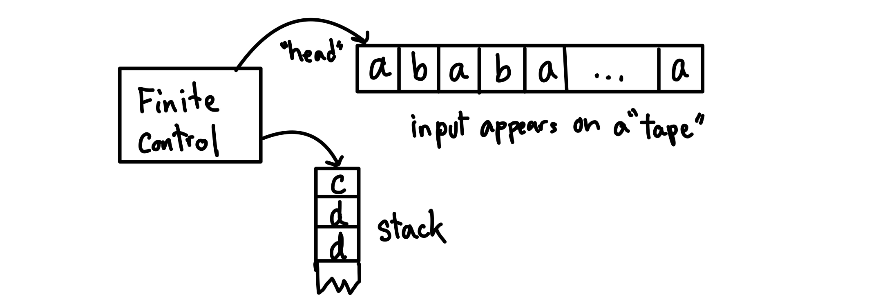

A pushdown automaton is similar to a finite automaton but has a stack, which is a form of auxiliary storage, attached to it.

A finite automaton has a very limited amount of memory, making it unable to do simple tasks like counting. A pushdown automaton can use its stack as a kind of unbounded but restricted memory.

PDA operates like an NFA except it can write/add (push) or read/remove (pop) symbols from the top of stack.

Example:

PDA for $`D = \{0^{k}1^{k} \mid k \geq 0\} `$

1) Read 0s from input, push onto stack until read 1.
2) Read 1s from input, while popping 0s from stack.
3) Enter accept state if stack is empty. (acceptance only at the end of input)

### Formal definition

**Definition**: A pushdown automaton (PDA) is a 7-tuple $(Q, \Sigma, \Gamma, \delta, q_{0}, Z_{0}, F)$

$\Sigma$ = input alphabet

$\Gamma$ = stack alphabet

$Z_{0}$ = initial stack symbol

$` \delta : Q \times \Sigma_{\varepsilon} \times \Gamma_{\varepsilon} \rightarrow \mathcal{P}(Q \times \Gamma_{\varepsilon})`$

$` \delta(q,a,c) = \{(r_{1},d),(r_{2},e)\} `$

Example: PDA for $` B = \{ww^{R} \mid w \in \{0,1\}^{*} \} `$

Sample input: 0 1 1 1 1 0

1) Read and push input symbols. Nondeterministically either repeat or go to (2)
2) Read input symbols and pop stack symbols, compare. If ever disagrees, then thread rejects.
3) Enter accept state if stack is empty.

The nondeterministic forks replicate the stack.

This language requires nondeterminism. Our PDA model in nondeterministic.

## Converting CFGs to PDAs

**Theorem**: If $A$ is a CFL, then some PDA recognizes $A$

**Proof**: Convert $A$'s CFG to a PDA

**IDEA**: PDA begins with starting variable and guesses substitutions. It keeps intermediate generated strings on stack. When done, compare with input.

**Problem**: We cannot access below the top of stack.

**Solution**: Only substitute variables when on top of the stack. If a terminal is on the top of stack, pop it and compare with input. Reject if disagree.

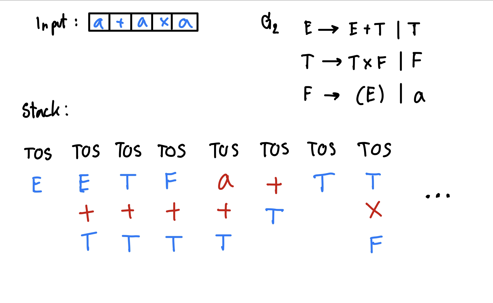

**Theorem**: If $A$ is a CFL, then some PDA recognizes $A$

**Proof construction**:

Convert the CFG for $A$ to the following PDA.

1) Push the start symbol on the stack.
2) If the top of stack is a **variable**, replace it with right hand side of rule (nondeterministic choice). If it's a **terminal** symbol, pop it and match with next input symbol.
3) If the stack is empty, accept.

## Equivalence of CFGs and PDAs

**Theorem**: $A$ is a CFL $\iff$ some PDA recognizes $A$

**Corollaries**:

- Every regular language is a CFL.
- If $A$ is a CFL and $B$ is regular then $A \cap B$ is a CFL. *While reading the input, the finite control of the PDA for A simulates the DFA for B.*

**Note 1**: If $A$ and $B$ are CFLs then $A \cap B$ may not be a CFL. Therefore the class of CFLs is not closed under intersection.

**Note 2**: The class of CFLs is closed under concatenation, union, star.

## Proving Languages not Context Free

Let $` B = \{0^{k}1^{k}2^{k} \mid k \geq 0\} `$

Show that $B$ is not a CFL.

**Pumping Lemma for CFLs**: For every CFL $A$, there is a $p$ such that if $s \in A$ and $\left | s \right | \geq p$ then $s = uvxyz$ where

1) $uv^{i}xy^{i}z \in A$ for all $i \geq 0$
2) $vy \neq \varepsilon$
3) $\left | vxy \right | \leq p$

*May be continued at a later date as 2301379 does not seem to cover this.*

---

# Midterm Quick Reference

Every regular language is a context-free language. DFAs/NFAs are just PDAs that do not use their stack.

## Closure Properties

**Regular Language**

Union, Concatenation, Kleene Star, Intersection, Complement, Reversal, Difference

NOT: Intersection with CFL, Complementation with CFL

**Context Free Language**

Union, Concatenation, Kleene Star, Reversal

NOT: Intersection, Complementation, Difference

**HOWEVER:**

$\text{CFL} \cap \text{RL}$ is context-free.

$\text{CFL} - \text{RL}$ is context-free.

$\text{RL} - \text{CFL}$ is not always context-free.

---

Notes for Chulalongkorn University 2301379 Theory of Computation (2566/1) based on lecture by

Prof. Michael Sipser. Theory Of Computation. Fall 2020. Massachusetts Institute of Technology: MIT OpenCouseWare, https://ocw.mit.edu/. License: Creative Commons BY-NC-SA.