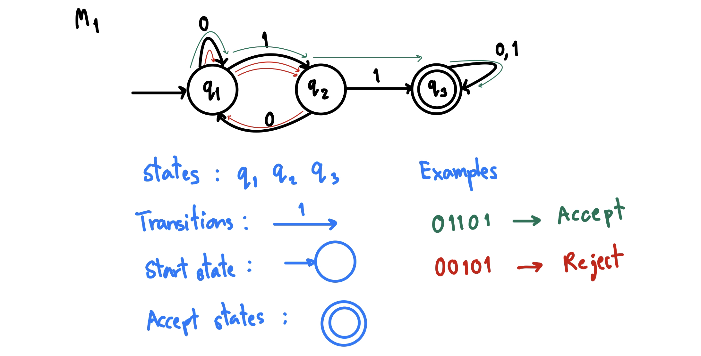
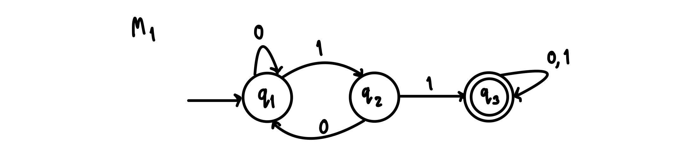

# 2301379 THEORY OF COMPUTATION

## Table of Contents
- [Midterm](#midterm)
  - [Finite Automata](#finite-automata)
    - [Formal definition](#formal-definition)
    - [Computation](#computation)
  - [Regular Languages](#regular-languages)
  - [Regular Expressions](#regular-expressions)
  - [Closure Properties for Regular Languages](#closure-properties-for-regular-languages)

## Finite Automata

**Input**: finite string

**Output**: *Accept* or *Reject*

Computation process: Begin at **start state**, read input symbols, follow corresponding transitions, **accept** if end with accept state, **reject** if not.

$M_{1}$ accepts exactly those strings in $A$ where $A = \\{w \mid w \text{ contains substring } 11\\}$

We say that $A$ is the language of $M_{1}$ and that $M_{1}$ recognizes $A$ and that $A = L(M_{1})$.

### Formal definition

**Definition**: A finite automaton $M$ is a 5-tuple $(Q, \Sigma, \delta, q_{0}, F)$

$Q$ - finite set of states

$\Sigma$ - finite set of alphabet symbols

$\delta$ - transition function $\delta: Q \times \Sigma \rightarrow Q$ 

$q_{0}$ - start state

$F$ - set of accept states

We can describe $M_{1}$ above with the following notation:

$M_{1} = (Q, \Sigma, \delta, q_{1}, F)$

$Q = \\{q_{1}, q_{2}, q_{3}\\}$

$\Sigma = \\{0, 1\\}$

$F = \\{q_{3}\\}$

$\delta =$ 

|         | 0       | 1       |
| :-----: | :-----: | :-----: |
| $q_{1}$ | $q_{1}$ | $q_{2}$ |
| $q_{2}$ | $q_{1}$ | $q_{3}$ |
| $q_{3}$ | $q_{3}$ | $q_{3}$ |

### Computation

**Strings and languages**

- A *string* is a finite sequence of symbols in $\Sigma$
- A *language* is a set of strings (finite or infinite)
- The *empty string* $\varepsilon$ is the string of length 0
- The *empty language* $\varnothing$ is the set with no strings

**Definition**: $M$ accepts string $w = w_{1} w_{2} \ldots w_{n}$ each $w_{i} \in \Sigma$ if there is a sequence of states $r_{0}, r_{1}, r_{2}, \ldots, r_{n} \in Q$
where:
- $r_{0} = q_{0}$
- $r_{i} = \delta(r_{i-1}, w_{i})$ for $1 \leq i \leq n$
- $r_{n} \in F$

**Recognizing languages**

- $L(M) = \\{w \mid M \text{ accepts } w\\}$
- $L(M)$ is the language of $M$
- $M$ recognizes $L(M)$

**Definition**: A language is *regular* if some finite automaton recognizes it.

## Regular Languages

$L(M_{1}) = \\{w \mid w \text{ contains substring } 11\\} = A$

$\therefore A$ is regular

Examples:

Let $B = \\{w \mid w \text{ has an even number of 1s}\\}$

$B$ is regular

Let $C = \\{w \mid w \text{ has equal numbers of 0s and 1s}\\}$

$C$ is not regular

There is no way to recognize $C$ with a finite automaton.

## Regular Expressions

**Regular operations**

Let $A$ and $B$ be languages:

- Union: $A \cup B = \\{w \mid w \in A \text{ or } w \in B\\}$
- Concatenation: $A \cdot B = \\{xy \mid x \in A \text{ and } y \in B\\}$
- Star: $A^{*} = \\{x_{1}\ldots x_{k} \mid \text{each } x_{i} \in A \text{ for } k \geq 0\\}$ Note: $\varepsilon \in A^{*}$

Example:

Let $A$ = {good, bad} and $B$ = {boy, girl}
- $A \cup B$ = {good, bad, boy, girl}
- $AB$ = {goodboy, goodgirl, badboy, badgirl}
- $A^{*}$ = {$\varepsilon$, good, bad, goodgood, goodbad, badgood, badbad, goodgoodgood, goodgoodbad, ... }

**Regular expressions**

- Built from $\Sigma$, members $\Sigma$, $\varnothing$, $\varepsilon$ (Atomic)
- By using $\cup$, $\cdot$, $*$ (Composite)

Examples:

- $(0 \cup 1)^{*} = \Sigma^{*}$ gives all strings over $\Sigma$
- $\Sigma^{*}1$ gives all strings that end with 1
- $\Sigma^{*}11\Sigma^{*}$ gives all strings that contain 11

## Closure Properties for Regular Languages

**Theorem**: If $A_{1}$ and $A_{2}$ are regular languages, so is $A_{1} \cup A_{2}$ *(closure under union)*

*When a collection of objects is said to be closed under an operation, it means that applying that operation to the objects results in objects that still belong to the same class of objects.*

**Proof**:

Let $M_{1} = (Q_{1}, \Sigma_{1}, \delta, q_{1}, F_{1})$ recognize $A_{1}$

Let $M_{2} = (Q_{2}, \Sigma_{2}, \delta, q_{2}, F_{2})$ recognize $A_{2}$

Construct $M = (Q, \Sigma, \delta, q_{0}, F)$ recognizing $A_{1} \cup A_{2}$

$M$ should accept input $w$ if either $M_{1}$ or $M_{2}$ accept $w$.

**Strategy**: Take $M_{1}$ and $M_{2}$ then run both of them in parallel on the input $w$. At the end, if either of the two machines is in an accepting state, then $M$ accepts $w$.

**Components of $M$**:

$Q = Q_{1} \times Q_{2} = \\{(q_{1}, q_{2}) \mid q_{1} \in Q_{1} \text{ and } q_{2} \in Q_{2}\\}$

$q_{0} = (q_{1}, q_{2})$

$\delta((q, r), a) = (\delta_{1}(q, a), \delta_{2}(r, a))$

$F = (F_{1} \times Q_{2}) \cup (Q_{1} \times F_{2})$

**Theorem**: If $A_{1}$ and $A_{2}$ are regular languages, so is $A_{1}A_{2}$ *(closure under concatenation)*

Let $M_{1} = (Q_{1}, \Sigma_{1}, \delta, q_{1}, F_{1})$ recognize $A_{1}$

Let $M_{2} = (Q_{2}, \Sigma_{2}, \delta, q_{2}, F_{2})$ recognize $A_{2}$

Construct $M = (Q, \Sigma, \delta, q_{0}, F)$ recognizing $A_{1}A_{2}$

$M$ should accept input $w$ if $w = xy$ where $M_{1}$ accepts $x$ and $M_{2}$ accepts $y$.

**Strategy**: to be continued...

---
Notes for Chulalongkorn University 2301379 Theory of Computation (2566/1) with additional materials from:

Prof. Michael Sipser. Theory Of Computation. Fall 2020. Massachusetts Institute of Technology: MIT OpenCouseWare, https://ocw.mit.edu/. License: Creative Commons BY-NC-SA.